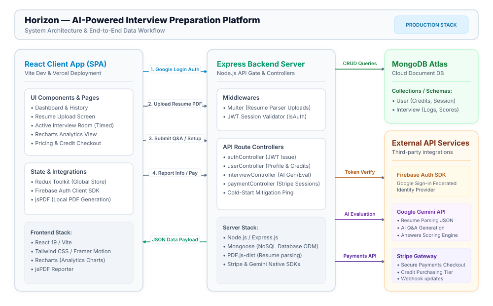

# Horizon: AI-Powered Interview Preparation Platform

Horizon is a comprehensive, full-stack web application designed to help job seekers master their interview skills through AI-driven simulations. By leveraging advanced natural language processing and performance analytics, the platform provides a realistic interview experience with actionable feedback.

## Key Technical Features

- **AI-Driven Behavioral & Technical Interviews**: Utilizes the Google Gemini API to generate dynamic, role-specific interview questions and provide real-time interaction.
- **Intelligent Resume Analysis**: Automated parsing of uploaded resumes to tailor interview questions based on the candidate's specific background and projects.
- **Performance Analytics**: Visual representation of interview results using Recharts, offering granular insights into confidence, communication, and correctness.
- **Automated Report Generation**: Generates detailed PDF performance reports using jsPDF.
- **Secure Authentication**: Integrated Firebase Authentication for secure user onboarding.
- **Premium Tier Access**: Stripe integration for purchasing interview credits and unlocking advanced features.
- **Fully Responsive UI/UX**: A modern, fluid interface built with React, Tailwind CSS, and Framer Motion, optimized for mobile, tablet, and desktop devices.
- **Cold-Start Mitigation**: Intelligent client-side server warm-up strategy to prevent backend sleep delays on free-tier hosting.

## Core Tech Stack

### Frontend
- **React 19 & Vite**: Modern UI library and ultra-fast build tool.
- **Tailwind CSS**: Utility-first CSS framework for rapid and consistent styling.
- **Redux Toolkit**: Efficient global state management.
- **Framer Motion**: Smooth micro-animations and page transitions.

### Backend
- **Node.js & Express**: Scalable server-side environment.
- **MongoDB & Mongoose**: NoSQL database for flexible data storage.
- **Google Gemini API**: Advanced LLM integration for intelligent interview logic.
- **Stripe API**: Secure payment processing.

## System Architecture & Workflow



Horizon is built using a modern, decoupled client-server architecture designed for high scalability, real-time AI processing, and secure transactions.

### Architectural Breakdown
- **Frontend Client (React SPA)**: A modern interface built with React 19, styled using Tailwind CSS, and powered by Redux Toolkit for clean state management. It leverages Recharts for rendering analytics and jsPDF for client-side PDF document compilation.
- **Backend API Gateway (Express)**: An asynchronous Node.js server that validates client requests, manages user permissions, handles resume uploads with Multer, and orchestrates calls to MongoDB Atlas and downstream cloud service APIs.
- **Database Layer (MongoDB Atlas)**: Stores user credits, user profiles, and granular logs of past interviews using flexible, optimized Mongoose schemas.
- **Cloud Integrations**:
  - **Google Gemini API**: Utilized as the NLP engine for extracting structured resume data, generating tailored interview questions, and scoring user answers.
  - **Firebase Auth**: Manages federated Google Sign-In secure identity verification.
  - **Stripe API**: Processes checkouts for interview credit bundles and handles updates via webhooks.

### End-to-End Core Flows
1. **Federated Authentication**: User signs in with Google via the Firebase Auth Client SDK. The client forwards the token to the `/api/auth/google` endpoint, where the backend validates, updates MongoDB, and issues a secure HTTP-Only JWT cookie.
2. **Resume Analysis**: The client uploads a PDF resume. The Express server intercepts it using Multer, extracts raw text via `pdfjs-dist`, and feeds it into the Google Gemini API to return a structured JSON profile (skills, projects, experience).
3. **Asynchronous Question Generation**: The client requests tailored interview questions. The server checks the user's credits, prompts the Gemini API with the candidate's resume profile, saves the 5 generated questions, and returns them to the client.
4. **Answer Evaluation & Scoring**: The client submits timed question answers to the server. The server forwards the question-answer pairs to Gemini to grade on three core criteria: **Confidence**, **Communication**, and **Correctness**. The final score is computed, stored in MongoDB, and sent back as feedback.
5. **Report Compilation**: When an interview finishes, the backend aggregates the analytics metrics. The frontend displays these details using Recharts for graphic visualizations and compiles a downloadable PDF report locally with jsPDF.

---

## Getting Started (Local Development)

### Prerequisites
- Node.js (v18 or higher)
- MongoDB account (local or Atlas)
- Google Gemini API Key
- Stripe Developer Account
- Firebase Project

### Installation

1. **Clone the repository:**
   ```bash
   git clone <repository-url>
   cd Horizon
   ```

2. **Backend Setup:**
   ```bash
   cd server
   npm install
   ```
   Create a `.env` file referencing `.env.example` in the `server` directory:
   ```env
   PORT=8000
   MONGO_URL=your_mongodb_connection_string
   JWT_SECRET=your_jwt_secret
   GEMINI_API_KEY=your_gemini_api_key
   CLIENT_URL=http://localhost:5173
   STRIPE_SECRET_KEY=your_stripe_secret_key
   ```
   Start the server:
   ```bash
   npm run dev
   ```

3. **Frontend Setup:**
   ```bash
   cd ../client
   npm install
   ```
   Create a `.env` file referencing `.env.example` in the `client` directory:
   ```env
   VITE_FIREBASE_APIKEY=your_firebase_api_key
   VITE_STRIPE_PUBLISHABLE_KEY=your_stripe_publishable_key
   VITE_SERVER_URL=http://localhost:8000
   ```
   Start the client:
   ```bash
   npm run dev
   ```

## Production Deployment (Render & Vercel)

The application is pre-configured for deployment on modern cloud platforms.

### 1. Backend (Render)
- Connect your GitHub repository to Render and create a **Web Service**.
- Set the root directory to `server`.
- Build Command: `npm install`
- Start Command: `npm start`
- Add all environment variables from your local `server/.env` (Update `CLIENT_URL` to your Vercel domain).

### 2. Frontend (Vercel)
- Import the repository to Vercel and select the `client` folder as the root.
- The framework preset will automatically detect Vite.
- Add your environment variables from `client/.env` (Update `VITE_SERVER_URL` to your Render domain).
- The included `vercel.json` will automatically handle SPA routing to prevent 404 errors on page refresh.

## License
This project is licensed under the ISC License.
